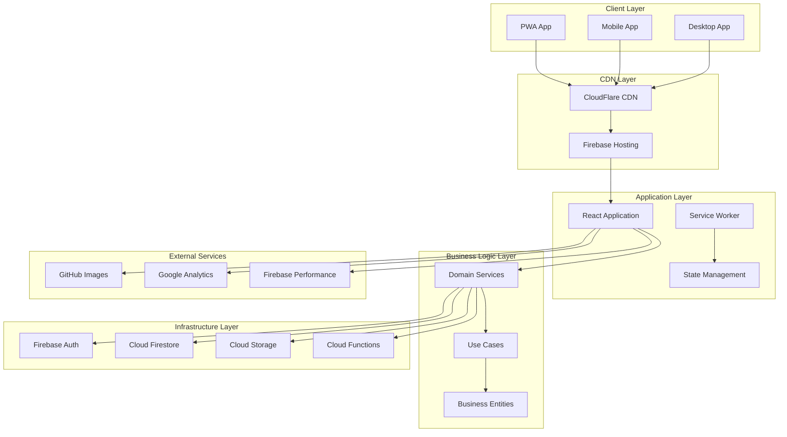
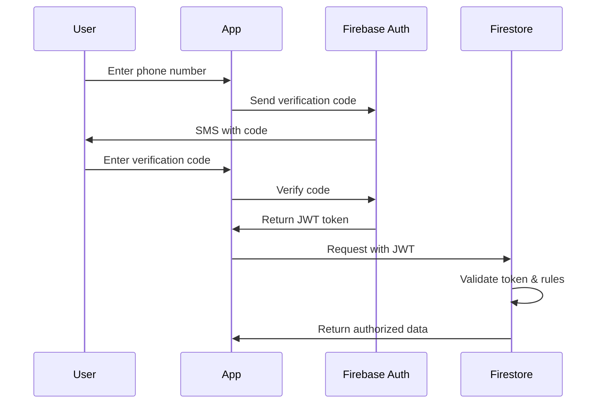

# 🏛️ ארכיטקטורת מערכת GymIQ - מסמך טכני מפורט

## 🎯 עקרונות ארכיטקטורה

### Core Principles
- **Domain-Driven Design (DDD)** - ארגון לפי תחומי עסק
- **Clean Architecture** - הפרדה בין שכבות
- **SOLID Principles** - עקרונות תכנות נקיים
- **Micro-Frontend Architecture** - מודולריות גבוהה

### Architectural Patterns
- **Repository Pattern** - הפרדת לוגיקת גישה לנתונים
- **Observer Pattern** - מעקב אחר שינויים במצב
- **Factory Pattern** - יצירת אובייקטים מורכבים
- **Facade Pattern** - ממשק פשוט לפונקציונליות מורכבת

---

## 🏗️ System Architecture Overview



---

## 📁 Detailed Folder Structure

### Project Root Structure
```
gymiq/
├── 📱 apps/                    # Application entry points
│   ├── web/                    # Web application
│   ├── mobile/                 # Mobile-specific code
│   └── desktop/                # Desktop application
│
├── 📦 packages/                # Shared packages
│   ├── design-system/          # UI components & themes
│   ├── business-logic/         # Domain logic
│   ├── infrastructure/         # External services
│   └── shared/                 # Cross-cutting concerns
│
├── 🛠️ tools/                   # Development tools
│   ├── build/                  # Build configurations
│   ├── testing/                # Test utilities
│   └── deployment/             # Deployment scripts
│
├── 📚 docs/                    # Documentation
│   ├── architecture/           # Architecture docs
│   ├── api/                    # API documentation
│   └── user-guides/            # User documentation
│
└── 🔧 config/                  # Configuration files
    ├── eslint/                 # Linting rules
    ├── typescript/             # TS configurations
    └── vite/                   # Build tool configs
```

### Core Application Structure (`apps/web/src/`)
```
src/
├── 🏛️ core/                    # Core application logic
│   ├── config/                 # Configuration management
│   │   ├── env.ts              # Environment variables
│   │   ├── firebase.ts         # Firebase configuration
│   │   └── constants.ts        # Application constants
│   │
│   ├── types/                  # Global TypeScript types
│   │   ├── api.ts              # API response types
│   │   ├── entities.ts         # Business entity types
│   │   └── utils.ts            # Utility types
│   │
│   └── utils/                  # Cross-cutting utilities
│       ├── validation.ts       # Input validation
│       ├── formatting.ts       # Data formatting
│       └── helpers.ts          # General helpers
│
├── 🎨 design-system/           # Design system implementation
│   ├── tokens/                 # Design tokens
│   │   ├── colors.ts           # Color palette
│   │   ├── spacing.ts          # Spacing scale
│   │   ├── typography.ts       # Font definitions
│   │   └── motion.ts           # Animation values
│   │
│   ├── components/             # UI components
│   │   ├── atoms/              # Basic elements
│   │   │   ├── Button/
│   │   │   ├── Input/
│   │   │   └── Text/
│   │   ├── molecules/          # Combined elements
│   │   │   ├── SearchBox/
│   │   │   ├── Card/
│   │   │   └── Modal/
│   │   └── organisms/          # Complex components
│   │       ├── Header/
│   │       ├── Sidebar/
│   │       └── DataTable/
│   │
│   ├── layouts/                # Layout components
│   │   ├── AppLayout/
│   │   ├── AuthLayout/
│   │   └── DashboardLayout/
│   │
│   └── themes/                 # Theme definitions
│       ├── light.ts
│       ├── dark.ts
│       └── provider.tsx
│
├── 🏢 domains/                 # Business domains (DDD)
│   ├── authentication/         # User authentication
│   │   ├── components/         # Auth-specific UI
│   │   ├── hooks/              # Auth hooks
│   │   ├── services/           # Auth business logic
│   │   ├── types/              # Auth types
│   │   └── utils/              # Auth utilities
│   │
│   ├── workouts/              # Workout management
│   │   ├── components/
│   │   │   ├── WorkoutBuilder/
│   │   │   ├── WorkoutSession/
│   │   │   └── WorkoutHistory/
│   │   ├── hooks/
│   │   │   ├── useWorkoutBuilder.ts
│   │   │   ├── useWorkoutSession.ts
│   │   │   └── useWorkoutHistory.ts
│   │   ├── services/
│   │   │   ├── WorkoutService.ts
│   │   │   └── WorkoutRepository.ts
│   │   ├── types/
│   │   │   ├── workout.types.ts
│   │   │   └── session.types.ts
│   │   └── utils/
│   │       ├── workout-calculations.ts
│   │       └── session-helpers.ts
│   │
│   ├── exercises/             # Exercise library
│   │   ├── components/
│   │   │   ├── ExerciseLibrary/
│   │   │   ├── ExerciseDetail/
│   │   │   └── ExerciseSearch/
│   │   ├── services/
│   │   │   └── ExerciseService.ts
│   │   └── types/
│   │       └── exercise.types.ts
│   │
│   ├── users/                 # User management
│   │   ├── components/
│   │   │   ├── UserProfile/
│   │   │   └── UserSettings/
│   │   ├── services/
│   │   │   └── UserService.ts
│   │   └── types/
│   │       └── user.types.ts
│   │
│   ├── trainers/              # Trainer functionality
│   │   ├── components/
│   │   │   ├── ClientManagement/
│   │   │   ├── ProgramBuilder/
│   │   │   └── TrainerDashboard/
│   │   ├── services/
│   │   │   ├── TrainerService.ts
│   │   │   └── ClientService.ts
│   │   └── types/
│   │       ├── trainer.types.ts
│   │       └── client.types.ts
│   │
│   └── analytics/             # Data analytics
│       ├── components/
│       │   ├── ProgressCharts/
│       │   ├── AnalyticsDashboard/
│       │   └── ReportsView/
│       ├── services/
│       │   └── AnalyticsService.ts
│       └── types/
│           └── analytics.types.ts
│
├── 🔧 infrastructure/          # External services integration
│   ├── firebase/               # Firebase services
│   │   ├── auth.service.ts
│   │   ├── firestore.service.ts
│   │   ├── storage.service.ts
│   │   └── functions.service.ts
│   │
│   ├── api/                    # External API clients
│   │   ├── github.client.ts    # Exercise images
│   │   └── analytics.client.ts # Analytics APIs
│   │
│   └── storage/                # Storage adapters
│       ├── local.storage.ts
│       ├── session.storage.ts
│       └── indexed.db.ts
│
├── 🎯 shared/                  # Shared utilities
│   ├── components/             # Reusable components
│   │   ├── LoadingSpinner/
│   │   ├── ErrorBoundary/
│   │   └── LazyImage/
│   │
│   ├── hooks/                  # Custom React hooks
│   │   ├── useLocalStorage.ts
│   │   ├── useDebounce.ts
│   │   ├── useApi.ts
│   │   └── useAuth.ts
│   │
│   ├── services/               # Shared business logic
│   │   ├── notification.service.ts
│   │   ├── logger.service.ts
│   │   └── cache.service.ts
│   │
│   └── utils/                  # Helper functions
│       ├── date.utils.ts
│       ├── string.utils.ts
│       ├── number.utils.ts
│       └── array.utils.ts
│
└── 🚀 app/                     # Application bootstrap
    ├── router/                 # Routing configuration
    │   ├── index.tsx           # Router setup
    │   ├── routes.tsx          # Route definitions
    │   └── guards/             # Route guards
    │       ├── AuthGuard.tsx
    │       └── RoleGuard.tsx
    │
    ├── store/                  # Global state management
    │   ├── index.ts            # Store configuration
    │   ├── slices/             # State slices
    │   │   ├── auth.slice.ts
    │   │   ├── ui.slice.ts
    │   │   └── cache.slice.ts
    │   └── middleware/         # Store middleware
    │       └── logger.middleware.ts
    │
    ├── providers/              # Context providers
    │   ├── AppProviders.tsx    # Root providers
    │   ├── ThemeProvider.tsx   # Theme context
    │   └── AuthProvider.tsx    # Auth context
    │
    └── App.tsx                 # Main application component
```

---

## 🔄 Data Flow Architecture

### State Management Strategy
```typescript
// Global State Structure
interface AppState {
  // Authentication state
  auth: {
    user: User | null;
    isAuthenticated: boolean;
    isLoading: boolean;
    error: string | null;
  };
  
  // UI state
  ui: {
    theme: 'light' | 'dark' | 'auto';
    language: 'he' | 'en' | 'ar';
    notifications: Notification[];
    modals: ModalState[];
  };
  
  // Domain-specific state (managed by domain stores)
  workouts: WorkoutState;
  exercises: ExerciseState;
  users: UserState;
  analytics: AnalyticsState;
}

// Domain Store Pattern
class WorkoutStore {
  // State
  private state: WorkoutState;
  
  // Actions
  createWorkout(workout: WorkoutTemplate): Promise<void>;
  updateWorkout(id: string, updates: Partial<WorkoutTemplate>): Promise<void>;
  deleteWorkout(id: string): Promise<void>;
  
  // Selectors
  getWorkoutById(id: string): WorkoutTemplate | null;
  getWorkoutsByCategory(category: WorkoutCategory): WorkoutTemplate[];
  
  // Side effects
  subscribeToWorkouts(userId: string): Unsubscribe;
  syncWithServer(): Promise<void>;
}
```

### Component Communication Patterns
```typescript
// Props drilling (for simple cases)
Parent -> Child -> Grandchild

// Context API (for component trees)
<ThemeContext.Provider>
  <UserContext.Provider>
    <ComponentTree />
  </UserContext.Provider>
</ThemeContext.Provider>

// Global state (for app-wide state)
Zustand Store <-> React Components

// Event system (for loose coupling)
EventBus.emit('workout-completed', { workoutId, duration });
EventBus.on('workout-completed', handleWorkoutCompleted);
```

---

## 🔧 Service Architecture

### Service Layer Pattern
```typescript
// Base Service Interface
interface IService {
  initialize(): Promise<void>;
  cleanup(): Promise<void>;
}

// Repository Pattern Implementation
interface IWorkoutRepository {
  findById(id: string): Promise<WorkoutTemplate | null>;
  findByUserId(userId: string): Promise<WorkoutTemplate[]>;
  create(workout: WorkoutTemplate): Promise<string>;
  update(id: string, workout: Partial<WorkoutTemplate>): Promise<void>;
  delete(id: string): Promise<void>;
}

// Firebase Implementation
class FirestoreWorkoutRepository implements IWorkoutRepository {
  constructor(private db: Firestore) {}
  
  async findById(id: string): Promise<WorkoutTemplate | null> {
    const doc = await getDoc(doc(this.db, 'workouts', id));
    return doc.exists() ? { id: doc.id, ...doc.data() } as WorkoutTemplate : null;
  }
  
  // ... other methods
}

// Service Implementation
class WorkoutService implements IService {
  constructor(
    private repository: IWorkoutRepository,
    private validator: WorkoutValidator,
    private logger: ILogger
  ) {}
  
  async createWorkout(userId: string, workout: CreateWorkoutDto): Promise<string> {
    // Validation
    await this.validator.validateWorkout(workout);
    
    // Business logic
    const workoutTemplate: WorkoutTemplate = {
      ...workout,
      id: generateId(),
      createdBy: userId,
      createdAt: new Date(),
      updatedAt: new Date()
    };
    
    // Persistence
    const id = await this.repository.create(workoutTemplate);
    
    // Logging
    this.logger.info('Workout created', { userId, workoutId: id });
    
    return id;
  }
}
```

---

## 🛡️ Security Architecture

### Authentication Flow


### Security Layers
```typescript
// 1. Network Security
const securityHeaders = {
  'Content-Security-Policy': "default-src 'self'; script-src 'self' 'unsafe-inline'",
  'X-Content-Type-Options': 'nosniff',
  'X-Frame-Options': 'DENY',
  'X-XSS-Protection': '1; mode=block',
  'Strict-Transport-Security': 'max-age=31536000; includeSubDomains'
};

// 2. Authentication Security
interface AuthSecurity {
  jwtValidation: 'Firebase Admin SDK';
  tokenExpiry: '1 hour';
  refreshTokenRotation: 'Automatic';
  mfaSupport: 'SMS + TOTP';
}

// 3. Authorization Security
const firestoreRules = `
  rules_version = '2';
  service cloud.firestore {
    match /databases/{database}/documents {
      // Users can only access their own data
      match /users/{userId} {
        allow read, write: if request.auth.uid == userId;
      }
      
      // Trainers can access their clients' data
      match /workouts/{workoutId} {
        allow read, write: if request.auth.uid == resource.data.createdBy
                         || isTrainerOf(request.auth.uid, resource.data.createdBy);
      }
    }
  }
`;

// 4. Data Validation Security
class InputValidator {
  static validateWorkout(input: any): WorkoutTemplate {
    const schema = z.object({
      name: z.string().min(1).max(100),
      description: z.string().max(500).optional(),
      exercises: z.array(exerciseSchema).min(1),
      // ... other validations
    });
    
    return schema.parse(input);
  }
}
```

---

## 📊 Performance Architecture

### Caching Strategy
```typescript
// Multi-layer caching
interface CacheStrategy {
  // Browser cache
  browserCache: {
    staticAssets: 'Cache-Control: max-age=31536000'; // 1 year
    appShell: 'Service Worker cache-first';
    userData: 'Service Worker network-first';
  };
  
  // Application cache
  applicationCache: {
    exerciseLibrary: 'React Query with 24h stale time';
    userWorkouts: 'React Query with 5min stale time';
    userProfile: 'React Query with 30min stale time';
  };
  
  // Database cache
  databaseCache: {
    firestore: 'Built-in client cache';
    indexes: 'Optimized composite indexes';
  };
}

// Performance optimization
const performanceOptimizations = {
  // Code splitting
  routeSplitting: React.lazy(() => import('./WorkoutPage')),
  componentSplitting: React.lazy(() => import('./ExerciseLibrary')),
  
  // Bundle optimization
  bundleAnalysis: 'vite-bundle-analyzer',
  treeShaking: 'Automatic with ES modules',
  
  // Image optimization
  lazyLoading: 'Intersection Observer API',
  responsiveImages: 'srcset with multiple sizes',
  modernFormats: 'WebP with JPEG fallback',
  
  // Memory management
  componentCleanup: 'useEffect cleanup',
  eventListenerCleanup: 'addEventListener/removeEventListener',
  subscriptionCleanup: 'Unsubscribe on unmount'
};
```

---

## 🔄 Integration Architecture

### External Service Integration
```typescript
// Service Adapter Pattern
interface IImageService {
  getExerciseImage(exerciseId: string): Promise<string>;
  uploadUserImage(file: File): Promise<string>;
}

class GitHubImageService implements IImageService {
  private baseUrl = 'https://raw.githubusercontent.com/erezadam/exercise-images-en/main/';
  
  async getExerciseImage(exerciseId: string): Promise<string> {
    return `${this.baseUrl}${exerciseId}.jpg`;
  }
  
  async uploadUserImage(file: File): Promise<string> {
    throw new Error('GitHub is read-only, use Firebase Storage');
  }
}

class FirebaseImageService implements IImageService {
  constructor(private storage: FirebaseStorage) {}
  
  async getExerciseImage(exerciseId: string): Promise<string> {
    const ref = storageRef(this.storage, `exercises/${exerciseId}.jpg`);
    return getDownloadURL(ref);
  }
  
  async uploadUserImage(file: File): Promise<string> {
    const ref = storageRef(this.storage, `users/${generateId()}`);
    const snapshot = await uploadBytes(ref, file);
    return getDownloadURL(snapshot.ref);
  }
}

// Service Factory
class ServiceFactory {
  static createImageService(): IImageService {
    const config = getConfig();
    return config.useGitHub ? new GitHubImageService() : new FirebaseImageService();
  }
}
```

---

## 📱 Progressive Web App Architecture

### PWA Implementation Strategy
```typescript
// Service Worker Architecture
class ServiceWorkerManager {
  // Cache strategies by content type
  private strategies = {
    appShell: new CacheFirst(),
    userData: new NetworkFirst(),
    exerciseImages: new StaleWhileRevalidate(),
    apiCalls: new NetworkOnly()
  };
  
  // Background sync for offline actions
  async queueOfflineAction(action: OfflineAction): Promise<void> {
    await this.storage.addToQueue(action);
    await this.scheduleBackgroundSync();
  }
  
  // Push notification handling
  async handlePushNotification(event: PushEvent): Promise<void> {
    const data = event.data?.json();
    await self.registration.showNotification(data.title, {
      body: data.body,
      icon: '/icons/icon-192x192.png',
      actions: data.actions
    });
  }
}

// Offline capability
interface OfflineCapabilities {
  // Core features available offline
  workoutSession: 'Full offline support with sync';
  exerciseLibrary: 'Cached with periodic updates';
  userProfile: 'Read-only with offline edits queued';
  
  // Data synchronization
  syncStrategy: 'Automatic when online + manual trigger';
  conflictResolution: 'Last-write-wins with user notification';
}
```

---

## 🧪 Testing Architecture

### Testing Strategy Implementation
```typescript
// Test Structure
interface TestArchitecture {
  // Unit tests (70% coverage target)
  unit: {
    services: 'Mock dependencies, test business logic';
    utils: 'Pure function testing';
    hooks: 'React Testing Library hooks testing';
  };
  
  // Integration tests (20% coverage target)
  integration: {
    components: 'Render with real providers';
    apiIntegration: 'MSW for API mocking';
    userFlows: 'Multi-step user interactions';
  };
  
  // E2E tests (10% coverage target)
  e2e: {
    criticalPaths: 'Login, workout creation, session tracking';
    crossBrowser: 'Chrome, Firefox, Safari';
    devices: 'Desktop, tablet, mobile';
  };
}

// Test utilities
class TestUtils {
  // Custom render with providers
  static renderWithProviders(
    ui: ReactElement,
    options?: RenderOptions
  ): RenderResult {
    function Wrapper({ children }: { children: ReactNode }) {
      return (
        <ThemeProvider>
          <AuthProvider>
            <QueryClient>{children}</QueryClient>
          </AuthProvider>
        </ThemeProvider>
      );
    }
    
    return render(ui, { wrapper: Wrapper, ...options });
  }
  
  // Mock data factories
  static createMockUser(overrides?: Partial<User>): User {
    return {
      id: faker.datatype.uuid(),
      email: faker.internet.email(),
      displayName: faker.name.fullName(),
      ...overrides
    };
  }
}
```

---

## 📋 Development Workflow

### Git Strategy & CI/CD
```typescript
interface DevelopmentWorkflow {
  // Git branching strategy
  gitFlow: {
    main: 'Production-ready code';
    develop: 'Integration branch';
    feature: 'feature/workout-builder';
    release: 'release/v1.2.0';
    hotfix: 'hotfix/auth-bug-fix';
  };
  
  // Code review process
  codeReview: {
    required: 'All PRs require review';
    automated: 'ESLint, Prettier, TypeScript checks';
    manual: 'Architecture, logic, performance review';
  };
  
  // Continuous Integration
  ci: {
    triggers: 'Push to any branch';
    stages: ['lint', 'test', 'build', 'security-scan'];
    deployment: 'Auto-deploy to staging on develop push';
  };
  
  // Release process
  release: {
    versioning: 'Semantic versioning (semver)';
    changelog: 'Automated changelog generation';
    rollback: 'Instant rollback capability';
  };
}
```

---

*ארכיטקטורה זו מבטיחה קוד נקי, ניתן לתחזוקה וסקלבילי לטווח הארוך!* 🚀